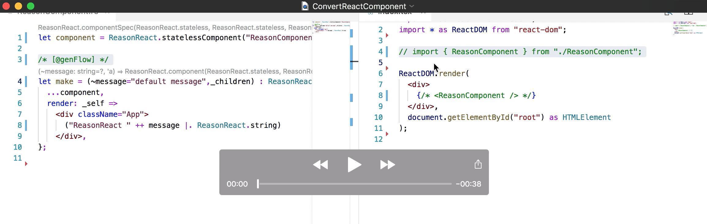

# genTypeScript

This is a companion repository to [genFlow](https://github.com/cristianoc/genFlow), to explore
typed bindings between [Reason](https://reasonml.github.io/) and [TypeScript](https://www.typescriptlang.org/).

[Here is a video illustrating the conversion of a ReasonReact component.](https://youtu.be/tlLoikU-etw)
[](https://youtu.be/tlLoikU-etw)

### Work in progress, only for early adopters. It is possible that the workflow will change in future.


## Building genFlow

Follow the instructions to build [genFlow](https://github.com/cristianoc/genFlow) 0.7.0 or later, and keep note of the `__path/__to/genflow.native`.


## Sample project [sample-typescript-app](sample-typescript-app)

#### Try the project:

```
# in sample-typescript-app
export BS_CMT_POST_PROCESS_CMD="__path/__to/genflow.native --setProjectRoot $PWD"
yarn install
yarn build
yarn start
```

#### For vscode users:
Configure the extension [OCaml and Reason IDE](https://marketplace.visualstudio.com/items?itemName=freebroccolo.reasonml) to start `bsb` from the editor itself:
```
"reason.diagnostics.tools": ["merlin", "bsb"],
```
and start vscode **after** setting environment variable `BS_CMT_POST_PROCESS_CMD`:

```
# in sample-typescript-app
export BS_CMT_POST_PROCESS_CMD="__path/__to/genflow.native --setProjectRoot $PWD"
code .
```

#### Set up

Originally based off the template:
```
create-react-app sample-typescript-app --scripts-version=react-scripts-ts
```


The project was extended by adding a ReasonReact component [ReasonComponent.re](sample-typescript-app/src/ReasonComponent.re). The typed wrapper [ReasonComponent.tsx](sample-typescript-app/src/ReasonComponent.tsx) is generated automatically by genFlow. The wrapper is used by [index.tsx](sample-typescript-app/src/index.tsx).

Configuration files [bsconfig.json](sample-typescript-app/bsconfig.json), and [genflowconfig.json](sample-typescript-app/genflowconfig.json) were added.
The [shims](sample-typescript-app/src/shims) directory was added.

The linter was taught to ignore `.bs.js` files, see [tslint.json](sample-typescript-app/tslint.json).
